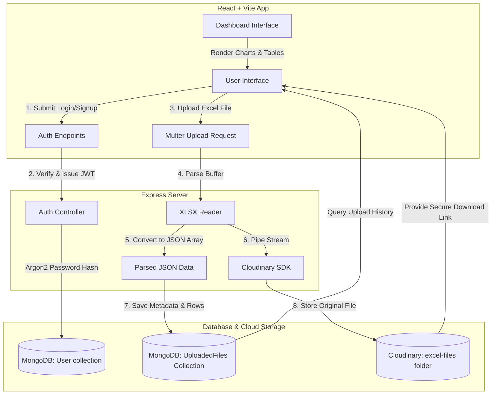

# 📊 Excel Data Visualizer & Cloud Manager

[](https://opensource.org/licenses/ISC)
[](https://reactjs.org/)
[](https://vitejs.dev/)
[](https://nodejs.org/)
[](https://www.mongodb.com/)
[](https://cloudinary.com/)

A comprehensive, full-stack MERN application that enables users to securely upload, manage, and interactively visualize Excel spreadsheet data (`.xls` & `.xlsx`). 

The application parses uploaded spreadsheet rows into structured JSON data on the fly, stores the parsed records in MongoDB for immediate querying and dashboard building, uploads the original spreadsheet files to Cloudinary for secure remote backup/download, and generates multiple chart visualizations (2D/3D Bar, Pie, Stacked Bar, and tabular data tables) using React and Recharts.

---

## 📌 Architecture & Data Flow

Below is the conceptual flow of the application from user upload to database storage, Cloudinary backups, and visualization:



---

## ✨ Features

### 🔑 1. User Authentication & Security
*   **User Registration & Login**: Interactive forms with custom validation.
*   **Secure Password Hashing**: Hashed at rest in MongoDB using the robust **Argon2** algorithm.
*   **JWT Token Session Management**: Secure verification via JSON Web Tokens stored in HTTP-Only cookies to protect against XSS/CSRF attacks.
*   **Password Updates**: Built-in support for password changes linked to verified usernames.

### 📤 2. Intelligent Excel Upload & Parsing
*   **Fast In-Memory Multer Processing**: Uploads excel spreadsheets without cluttering the backend filesystem.
*   **Automatic Parsing**: Uses `xlsx` (SheetJS) to convert the primary sheet's rows into native JSON data structures instantly.
*   **Dynamic Schema Mapping**: Identifies column headers dynamically, allowing compatibility with varying spreadsheet layouts.
*   **Duplicate and Validation Checking**: Ensures file formats are restricted to valid `.xls` or `.xlsx` files.

### ☁️ 3. Cloud Storage Integration (Cloudinary)
*   **Raw Upload Streaming**: Direct streaming of file buffers using Node streams.
*   **Remote Backups**: Excel files are stored within a dedicated folder (`excel-files`) on Cloudinary.
*   **One-Click Downloads**: Generates authenticated secure URLs allowing users to retrieve the exact uploaded binary file anytime.
*   **Cascading Deletions**: Deleting a file removes its record from the database and destroys the asset on Cloudinary.

### 📉 4. Dynamic Dashboard & Visualizations
*   **Interactive Table Viewer**: Displays spreadsheet contents in a sleek, responsive tabular structure.
*   **Comprehensive Chart Catalog**: High-performance visualizations using Recharts:
    *   **2D Bar Chart**: Standard comparison visualization.
    *   **3D-like Bar Chart**: Stylish rounded bars for dynamic reports.
    *   **Stacked Bar Chart**: Displays cumulative segments by year or branch.
    *   **2D Pie Chart**: Distribution representations.
    *   **3D-like Pie Chart**: Donut-style visualization of branch metrics.
*   **Automatic Column Mapping**: Detects numeric fields like `Profit`/`Loss` or categorical variables like `Branch` to automate chart layouts.

---

## 🛠️ Technology Stack

| Component | Technology | Description |
| :--- | :--- | :--- |
| **Frontend** | React 18 / Vite | Fast-loading UI shell with HMR |
| **Styling** | Bootstrap 5 + Vanilla CSS | Modern, clean layout with responsive grid structures |
| **Charts** | Recharts | React-wrapped SVG chart components |
| **Backend** | Node.js / Express | REST API, streaming middleware, and file handler routing |
| **Database** | MongoDB (via Mongoose) | Schema-less document modeling for spreadsheet payloads |
| **Cloud Storage**| Cloudinary SDK | Object storage for original spreadsheet binaries |
| **Security** | Argon2 & jsonwebtoken | Industry-standard password hashing and JWT token claims |
| **Parser** | SheetJS (xlsx) | Powerful spreadsheet-to-JSON engine |

---

## 📂 Project Structure

```text
Excel-Project-main/
├── backend/
│   └── backend/                     # Backend Source Code
│       ├── src/
│       │   ├── config/
│       │   │   ├── cloudinary.config.js # Cloudinary SDK config
│       │   │   ├── db.config.js         # Mongoose connection utility
│       │   │   └── multer.config.js     # Multipart upload setup
│       │   ├── controllers/
│       │   │   └── auth.controller.js   # User registration, login, profile logic
│       │   ├── middleware/
│       │   │   ├── auth.js              # JWT authentication gate
│       │   │   └── uploads.js           # Multer memory storage definition
│       │   ├── models/
│       │   │   ├── user.model.js        # User mongoose schema
│       │   │   └── uploadedFile.js      # Metadata and parsed JSON data schema
│       │   └── routes/
│       │       ├── auth.routes.js       # Auth API Endpoints
│       │       ├── file.routes.js       # Upload history API
│       │       └── upload.js            # Main Excel upload parser
│       ├── .env                         # Backend environment configuration
│       ├── index.js                     # Express App Initialization & CORS Setup
│       ├── package.json                 # Backend dependencies & script definitions
│       └── CLOUDINARY_SETUP.md          # Cloudinary-specific guides
│
└── f/                               # Frontend Source Code (React + Vite)
    ├── public/                      # Static Assets
    ├── src/
    │   ├── components/
    │   │   ├── Header/
    │   │   │   ├── Header.jsx           # Global Navigation bar
    │   │   │   └── Header.css
    │   │   ├── Login/
    │   │   │   ├── LoginPage.jsx        # Login, Signup, Forgot Password forms
    │   │   │   ├── Signup.jsx
    │   │   │   └── axios.jsx            # Configured Axios instance with baseURL
    │   │   ├── MainPage/
    │   │   │   ├── MainPage.jsx         # Upload portal interface
    │   │   │   ├── Dashboard.jsx        # Table / Recharts Dashboard component
    │   │   │   └── UploadedFiles.jsx    # User history and actions panel
    │   │   └── StartingPage/
    │   │       ├── StartingPage.jsx     # Landing splash page
    │   │       └── StartingPage.css
    │   ├── App.jsx                      # Client Router and global state
    │   ├── main.jsx                     # Entry mountpoint
    │   └── index.css                    # Global typography styles
    ├── vite.config.js               # Vite environment config
    └── package.json                 # Frontend dependencies & package config
```

---

## ⚙️ Environment Configuration

To run this application locally, you must create a `.env` file in the `backend/backend/` directory:

```env
# Server Port Configuration
PORT=8080

# Database Connectivity
MONGODB_URI=mongodb+srv://<username>:<password>@<cluster>.mongodb.net/<database>?retryWrites=true&w=majority

# Security (JWT Session Keys)
JWT_SECRET=your_jwt_secret_token_phrase

# Cloudinary Integration API Keys
CLOUDINARY_CLOUD_NAME=your_cloudinary_cloud_name
CLOUDINARY_API_KEY=your_cloudinary_api_key
CLOUDINARY_API_SECRET=your_cloudinary_api_secret

# Allowed CORS Origin
FRONTEND=http://localhost:5173
```

---

## 🚀 Setup & Local Installation

Follow these steps to spin up the application on your local machine:

### 1. Prerequisite Installations
*   Ensure **Node.js** (v18 or higher) and **npm** are installed.
*   Prepare a running **MongoDB** cluster (local or MongoDB Atlas).
*   Create a free **Cloudinary** account to collect cloud upload API keys.

### 2. Run the Backend Server
```bash
# Navigate to the backend directory
cd backend/backend

# Install dependencies
npm install

# Run the server in development mode (with nodemon hot reloading)
npm run start
```
The server will boot up at: `http://localhost:8080`.

### 3. Run the React Frontend
Open a new terminal window:
```bash
# Navigate to the frontend directory
cd f

# Install dependencies
npm install

# Start the Vite development server
npm run dev
```
The client app will launch at: `http://localhost:5173`.

---

## 🔗 API Route Reference

### 🔐 Authentication (`/auth`)
| Method | Endpoint | Payload | Description |
| :--- | :--- | :--- | :--- |
| **POST** | `/auth/register` | `{ username, email, password }` | Registers a new user. Default role is `"user"`. |
| **POST** | `/auth/login` | `{ email, password }` | Authenticates user credentials & responds with a HTTP-Only Cookie containing the token. |
| **GET** | `/auth/profile` | *None (Cookie req)* | Fetches the authenticated user profile object (excludes password). |
| **POST** | `/auth/changepassword` | `{ username, newPassword }` | Updates a user's password using username verification. |

### 📂 File Management & Parsing (`/api`)
| Method | Endpoint | Payload | Description |
| :--- | :--- | :--- | :--- |
| **POST** | `/api/upload` | `multipart/form-data` | Uploads raw spreadsheet to Cloudinary, parses data, and commits to MongoDB. |
| **GET** | `/api/uploads` | `?user=user@email.com` | Retrieves all spreadsheets uploaded by the matching user email. |
| **DELETE** | `/api/uploads/:fileId` | *None* | Deletes database entry & triggers asset deletion on Cloudinary. |

---

## 📄 License

This project is open-source and released under the [ISC License](https://opensource.org/licenses/ISC).
